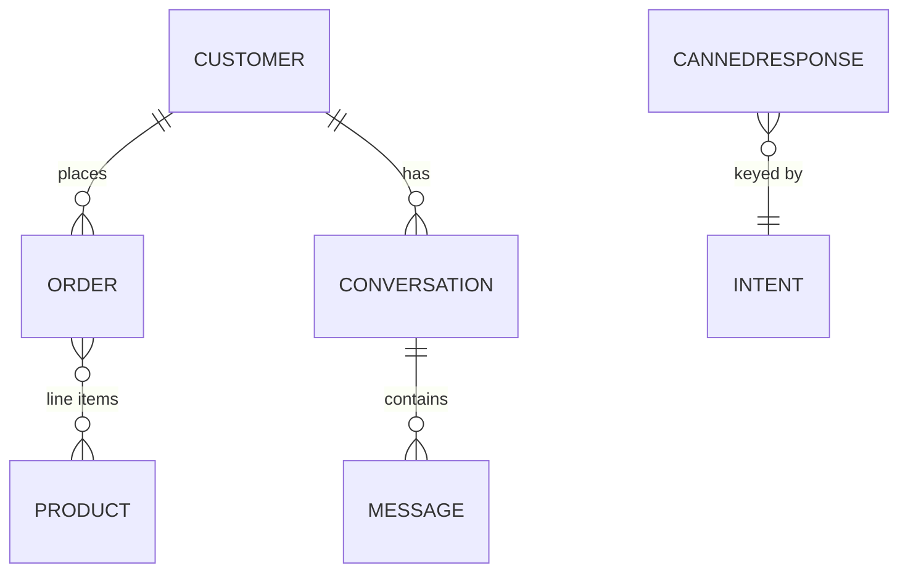

# Database Design

MongoDB (Mongoose). Connection string in `MONGODB_URI`. Local dev uses the `mongo` service in
`docker-compose.yml`; production uses MongoDB Atlas M0.

## Entity relationship

## Collections

### products
| field | type | notes |
|---|---|---|
| name | string, required | text-indexed |
| category | enum | dresses, kurtas, shalwar_kameez, lawn_suits, tops, bottoms, outerwear, footwear, accessories |
| price | number, required | integer PKR |
| currency | string | default `PKR` |
| description | string | text-indexed |
| sizes | string[] | e.g. `["S","M","L"]` |
| colors | string[] | stored lowercase |
| stock | number | default 0 |
| images | string[] | URLs |
| discount | number | percent, 0–70 |
| rating | number | 0–5, default 4.2 |
| gender | enum | women, men, unisex, kids |
| tags | string[] | trending, new_arrival, wedding, summer, … |
| salesCount | number | trending signal, bumped on each order |
| embedding | number[768] | Gemini `text-embedding-004`; `select:false` |
| isActive | boolean | default true |

Indexes: `text(name, description, tags)`, `{category, gender, price}`, `{salesCount:-1}`, `{tags:1}`.
Virtual: `discountedPrice`. Static: `Product.buildFilter(entities)`.

### customers
| field | type | notes |
|---|---|---|
| name | string | |
| phone / instagramId / whatsappId | string | each `unique, sparse` |
| address | subdoc | line1, line2, city, country (default Pakistan), postalCode, raw |
| orderHistory | ObjectId[] → order | |
| preferences | subdoc | gender, favoriteColor, budget, categories[] |
| language | enum | en, ur |
| tags | string[] | |

Static: `Customer.findOrCreateByChannel({ channel, senderId, name })`.

### orders
| field | type | notes |
|---|---|---|
| orderId | string, unique | `AFS-YYYYMMDD-NNNN` |
| customerId | ObjectId → customer | indexed |
| items | subdoc[] | productId, name, price (per-unit selling price), quantity, size, color |
| subtotal / discountTotal / total | number | computed in a pre-validate hook; `total = subtotal` (items already discounted) |
| status | enum | pending, confirmed, packed, shipped, delivered, cancelled, returned |
| paymentStatus | enum | unpaid, paid, cod_pending, refunded |
| trackingNumber | string | `TRK` + 9 base36 |
| channel | enum | instagram, whatsapp, simulator |
| shippingAddress | subdoc | |

Indexes: `{orderId:1}` unique, `{customerId:1}`, `{status:1}`, `{createdAt:-1}`.
Statics: `Order.genOrderId()`, `Order.genTracking()`.

### conversations
`customerId`, `channel`, `state` (NEW · GREETED · BROWSING · COLLECTING_ORDER · AWAITING_ADDRESS ·
AWAITING_CONFIRMATION · ORDER_PLACED · SUPPORT), `lastIntent`, `lastSentiment`, `language`,
`isOpen`, `needsHuman`, `summary`, `context` (Mixed — pending order draft).
Indexes: `{customerId:1, channel:1}`, `{isOpen:1, updatedAt:-1}`. Static: `Conversation.getOpen()`.

### messages
`conversationId` (indexed), `direction` (inbound|outbound), `text`, `channel`, `intent`,
`sentiment`, `entities` (Mixed), `attachments[]`, `provider`, `usage`. Index `{conversationId:1, createdAt:1}`.

### cannedResponses  ("Train AI Responses")
`key` (unique), `intent`, `language`, `triggerExamples[]`, `responseTemplate`, `isFewShot`,
`enabled`, `priority`. Index `{intent:1, language:1, enabled:1}`.
Non-few-shot rows are deterministic shortcut answers matched before the LLM; few-shot rows are
injected into the reply-generation prompt.

### adminUsers
`email` (unique), `passwordHash` (bcrypt), `name`, `role`. Methods `comparePassword`, `hashPassword`.

## Vector search

`infra/atlas/vector-index.json` defines the Atlas `$vectorSearch` index. When it is absent the
app ranks products with in-process cosine similarity over the filtered candidate set
(`VECTOR_BACKEND=auto`).
